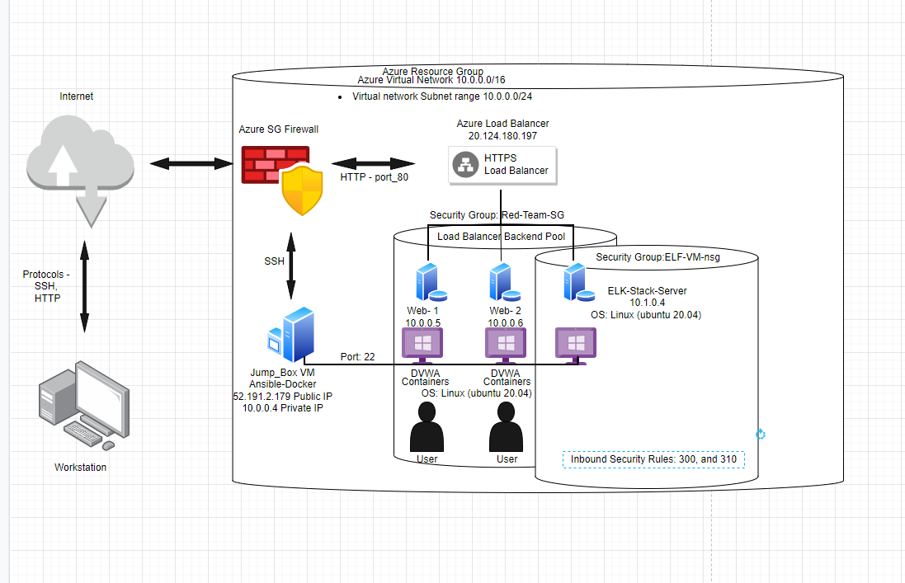

# ELK-Stack-Project-1

This is a ELK Stack setup up with AZURE Cloud Security.

<b>*## Automated ELK Stack Deployment*</b>

The files in this repository were used to configure the network depicted below.

  These files have been tested and used to generate a live ELK deployment on Azure. They can be used to either to recreate the entire deployment pictured above. Alternatively, select portions of the, [Metric_Playbook.YML](Metric_Playbook.txt), [Filebeat_Playbook.YML](Filebeat_Playbook.txt), [ELK_Play_book.YML](../ELk_Play_Book.txt), [YAML_Playbook.YML](YAML_Playbook.txt) file may be used to install only certain pieces of it, such as Filebeat.
  
  IN this folder: <b>ELK-Stack_Project-1</b>
This document contains the following details:

- Description of the Topology

- Access Policies

- ELK Configuration

  - Beats in Use
  
  - Machines Being Monitored
  
- How to Use the Ansible Build

### Description of the Topology

The main purpose of this network is to expose a load-balanced and monitored instance of DVWA, the D*mn Vulnerable Web Application.
Load balancing ensures that the application will be highly available, in addition to restricting access to the network.

- What aspect of security do load balancers protect? What is the advantage of a jump box? 
Load balancer protect the Availability to network traffic services and help minimize the effects of Ddos attacks.

The advantage of the jump box is to provide consistent access to the end-user.
Integrating an ELK server allows users to easily monitor the vulnerable VMs for changes to the network and system logs.

- What does Filebeat watch for?
Filebeat observes log events and forwards the information to admin user. 

- What does Metricbeat record?
Metricbeat periodically collects metrics from the Operating systems of the VMs and services running on the servers.
The configuration details of each machine may be found below.
_

| Name     | Function  | IP Address | Operating System |

|----------|-----------|------------|------------------|

| Jump Box | Gateway   | 10.0.0.4   | Linux            |

| Web- 1   | Web Server| 10.0.0.5   | Linux            |

| Web- 2   | Web Server| 10.0.0.6   | Linux            |

| Elf-VM   | Log Server| 10.1.0.4   | Linux            |

### Access Policies

The machines on the internal network are not exposed to the public Internet. 
Only the _Jump-Box-Provisioner____ machine can accept connections from the Internet. Access to this machine is only allowed from the following IP addresses:
- azuresuser@52.191.2.179
Machines within the network can only be accessed by _Jump-box____.
- _: Which machine did you allow to access your ELK VM? What was its IP address?
-Only the Jump box has access to the Elk vm via port 22.
-A PC with I.P. on port 52.191.2.179:5602 can access ELK vm via port 22.
A summary of the access policies in place can be found in the table below.

| Name     | Publicly Accessible | Allowed IP Addresses |

|----------|---------------------|----------------------|

| Jump Box | Yes                 |   52.191.2.179       |

| Web-1    | no                  |   10.0.0.4 &10.1.0.4 |

| Web-2    | no                  |   10.0.0.4 &10.1.0.4 |

| ELF-vm   | NO                  |   10.0.0.4           |

### Elk Configuration

Ansible was used to automate configuration of the ELK machine. No configuration was performed manually, which is advantageous because...

Setup is simple and no special coding skills are necessary to use. The program is flexible and coordinates entire application environment. A simple and sufficient way of setting out a process.

The playbook implements the following tasks:
  
  •	Install docker.io
  
  •	Install pip3
  
  •	Install Docker python module
  
  •	Increase VM memory
  
  •	Download and launch ELK container
  
  •	Enable docker services

The following screenshot displays the result of running `docker ps` after successfully configuring the ELK instance.
 

### Target Machines & Beats

This ELK server is configured to monitor the following machines:

-web-1 10.0.0.5
-web-2 10.0.0.6

We have installed the following Beats on these machines:

-Filebeat version 7.4.0
-Metricbeat version 7.4.0

These Beats allow us to collect the following information from each machine:

Filebeat is a lightweight shipper for monitoring and forwarding the log files for indexing.

Metricbeat takes metrics and statistics that it collects to output at a specific destination.

### Using the Playbook

In order to use the playbook, you will need to have an Ansible control node already configured. Assuming you have such a control node provisioned: 
SSH into the control node and follow the steps below:
- Copy the ___ filebeat-playbook.yml__ file to __ /etc/ansible/files/filebeat-config.yml ___.
- Update the _filebeat-config.yml____ file to include...
- Run the playbook, and navigate to __host I.P. and port number_52.191.2.179:5601_ to check that the installation worked as expected.

- _Which file is the playbook? Where do you copy it?_

ELK_Play_book.YML, to Jump Box is root root@58697de3ce36:/etc/ansible#

- _Which file do you update to make Ansible run the playbook on a specific machine? How do I specify which machine to install the ELK server on versus which to install Filebeat on?_

Ansible.cfg and /stc/ansible/ host.cfg

- _Which URL do you navigate to in order to check that the ELK server is running?
_ 
http://20.114.199.254:5601/app/kibana#/home
_
As a **Bonus**, provide the specific commands the user will need to run to download the playbook, update the files, etc._

Ansible-playbook ELK_Plsay_Book.ymlexit
Sudo 
